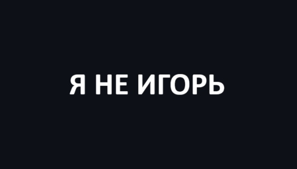

 
  Faça uma breve aprensentação sua com o seu nome e não esqueça a <strong>Sua stack</strong>. 
  Diga o que você está fazendo no momento, se trabalha ou estuda.

  🦄 Linguagens: **Coloque as linguagens que você desenvolve.**

  💼 Ferramentas: **Coloque as suas ferramentas de trabalho.**

  💌 Aqui vai uma mensagem para entrar em contato com você: ⤵️

  
  
  

